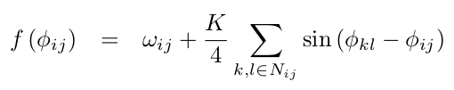
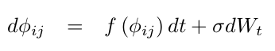

# Kuramoto lattice model in *Python* and *julia*

<!--

-->

This repo contains implementations of the Kuramoto coupled oscillator model on a 2D lattice.  
The code is available in Python and Julia.  

**Ref.:** Acebrón, J.A., Bonilla, L.L., Pérez Vicente, C.J., Ritort, F., Spigler, R., The Kuramoto model: A simple paradigm for synchronization phenomena. __*Rev Mod Phys*__ 77(1):137-185, 2005.

**Rendered page:** https://frederic-vw.github.io/kuramoto-2d/

**_Python_ Requirements:**
1. [python](https://www.python.org/) installation, latest version tested 3.6.9
2. python packages (`pip install package-name`)
  - NumPy
  - Matplotlib
  - SciPy
  - opencv-python (save data as movie)

**_Julia_ Requirements:**
1. [julia](https://julialang.org/) installation, latest version tested 1.6.1
2. julia packages (`julia > using Pkg; Pkg.add("Package Name")`)
  - Interpolations
  - NPZ
  - PyCall (load Matplotlib animation functionality)
  - PyPlot
  - Statistics
  - VideoIO (save data as movie)

## Kuramoto model

The Kuramoto lattice model is defined by:

Noise is added via stochastic integration:

The main function call running the simulation is: `kuramoto2d(N, T, t0, dt, s, K0, K1, sd_omega)`:  
- `N`: lattice size `(N,N)`
- `T`: number of simulation time steps
- `t0`: number of 'warm-up' iterations
- `dt`: integration time step
- `s`: noise intensity (&sigma;)
- `K0,K1`: Kuramoto coupling constant (start, end values)

**Outputs:** `(T,N,N)` array as NumPy .npy format and as .mp4 movie.

### Example-1
Parameters:  
`N = 128, T = 3000, t0 = 0, dt = 0.05, s = 0.2, K0 = 0.5, K1 = 4.0, sd_omega = 0.25`

<video src="videos/kuramoto2d_K_1.00_4.00_s_0.10_phi.webm" width="256" height="256" controls preload></video>

